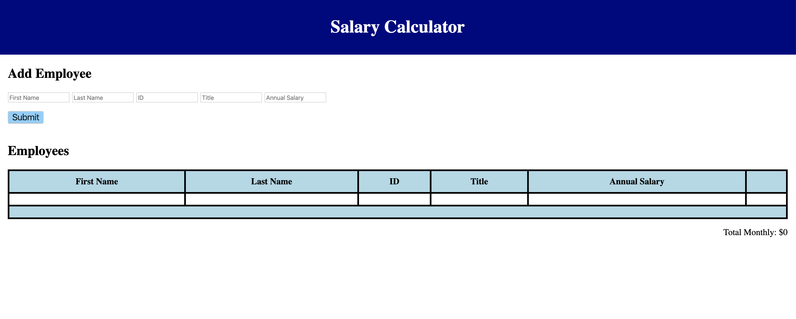

# jQuery salary calculator

## Description

Duration: 2 days / weekend challenge

This application allows users to add their employees and get an updated total monthly cost.
Built with JavaScript and jQuery (selectors, append and event handling)

- every line of code has explanation of what it's doing

[Project Instructions](./INSTRUCTIONS.md), this line may be removed once you have updated the README.md

## Usage

- Input form collects employee's first name, last name, ID number, job title and annual salary.
- When user clicks submit button, the employee's information will be added to the table below and total monthly cost will be updated.
- User can use delete button to remove the employee from the list. Total monthly cost will be updated accordingly.
- when the total monthly cost exceeds \$20,000, background color for the total monthly cost will change to red.

## Screenshot

